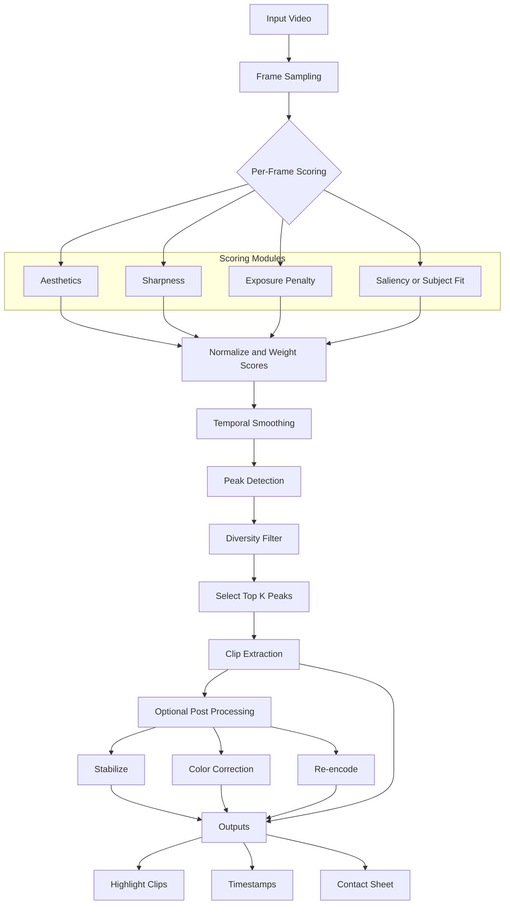

# Best-Shot Extraction Pipeline

Here's a **lean, production-ready pipeline** for **best-shot extraction from a single continuous take**.

## Goal
Return **top-K clips** (e.g., 3–7 seconds each) that look the best.

## Steps

### 1. Sample frames
- **FPS:** `2–5` (higher if motion is fast)
- Command: `ffmpeg -i in.mp4 -vf fps=3,scale=-2:720 frames/f_%06d.jpg`

### 2. Per-frame scoring
- **Aesthetics:** CLIP embedding → small MLP aesthetic head (or LAION aesthetic predictor)
- **Sharpness:** variance of Laplacian
- **Exposure:** histogram penalty for >99% whites or <1% blacks
- **Saliency/Subject** *(optional)*: CLIP similarity to a prompt (e.g., `"well-lit interior wide shot"`)
- **Score:** `S = w_a*Aest + w_s*Sharp - w_e*ExposurePenalty + w_c*CLIPsim`

### 3. Temporal smoothing
- Sliding window `W = 2–3 s`: `S_smooth[t] = mean(S[t−W..t+W])`

### 4. Peak picking (find "moments")
- Local maxima on `S_smooth` with minimum separation `Δ = 4–6 s`
- Keep top-`K` peaks

### 5. Clip extraction
- Around each peak time `t*`, cut `[t*−L_pre, t*+L_post]` (e.g., `1s + 2s`)
- **Stabilize** (if needed): `ffmpeg vidstab` or `deshake`
- **Export:**
  ```bash
  ffmpeg -ss <start> -i in.mp4 -t <dur> -c:v libx264 -crf 18 -preset veryfast out_k.mp4
  ```

### 6. Diversity (avoid near-dupes)
- Compute CLIP embeddings for peak frames; greedily keep peaks with cosine distance `> τ` (e.g., `τ=0.12`)

## Pseudocode (Python-ish)

```python
# [Pseudocode section appears to be missing from your input]
# Please provide the pseudocode content to complete this section
```

## Pipeline Flow Diagram


